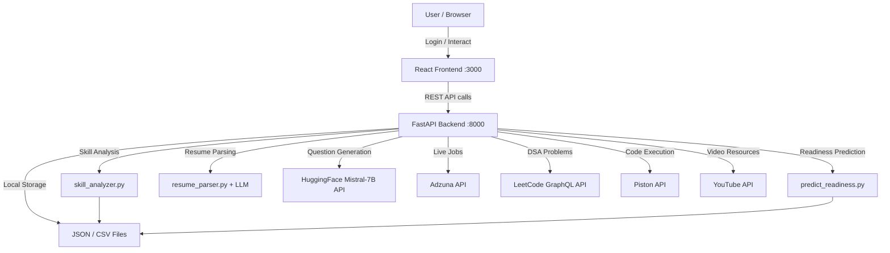
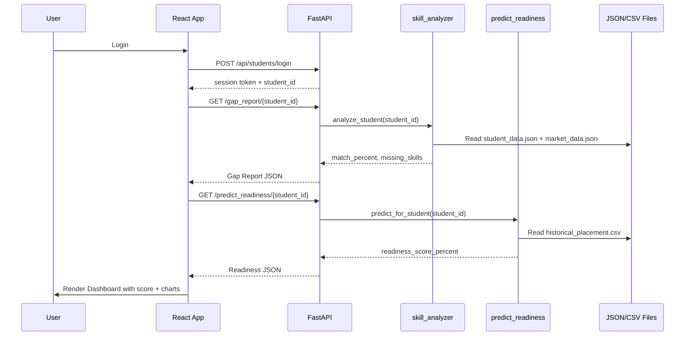
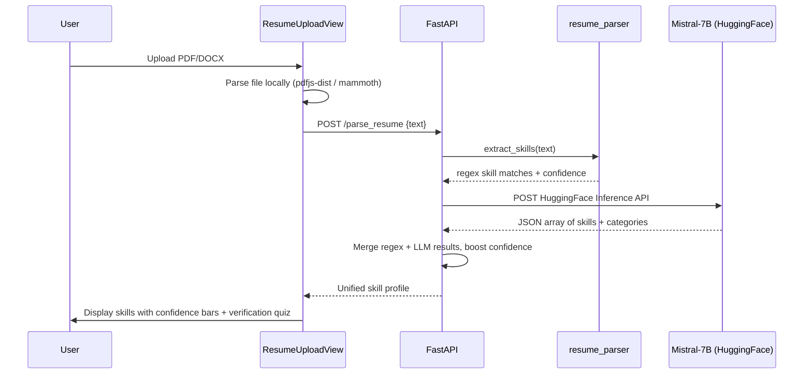
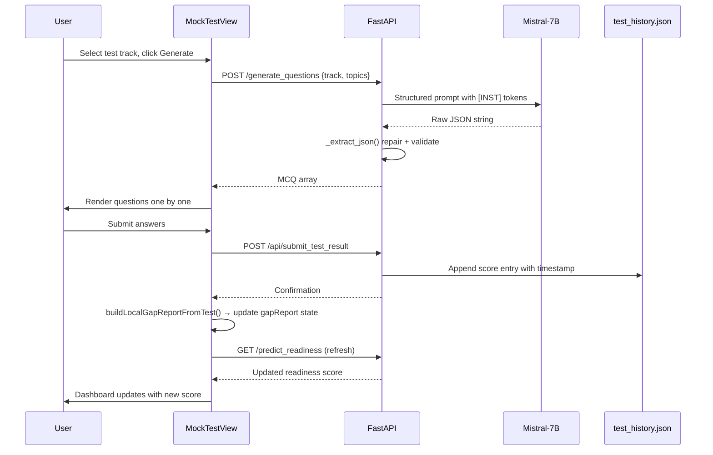
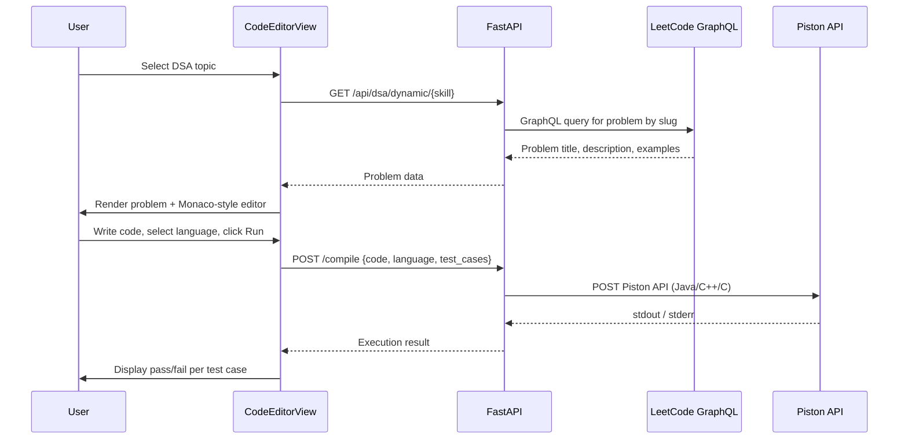

# Comprehensive Project Report: Placify AI

## 1. Introduction & Overview

**Placify AI** is a comprehensive, dynamic platform designed to bridge the gap between academic education and modern job market requirements. It functions as a full-stack, AI-powered platform that evaluates, assesses, and guides students toward readiness for job placements.

By utilizing a hybrid approach of traditional logic and advanced AI (such as the Mistral 7B LLM), Placify AI provides actionable insights into a student's resume, identifies skill gaps contrary to actual market requirements, and gives continuous feedback through mock tests and hands-on coding challenges.

### Core Objectives
*   **Assess:** Evaluate student readiness for placements out of 100%.
*   **Analyze:** Parse resumes to extract authenticated skills.
*   **Identify:** Discover gaps between current skills and industry demands.
*   **Train:** Prepare students through AI-generated questions and a dedicated DSA (Data Structures and Algorithms) coding lab.
*   **Track:** Monitor performance for administrators to identify at-risk students who need intervention.

---

## 2. Key Features & Functionalities

Placify AI offers several pivotal features:

1.  **Dashboard & Gap Analysis**
    *   Interactive widgets display the placement readiness score.
    *   Gap analysis highlights missing skills based on target job roles and live market data.
2.  **Smart Resume Parser (Regex + LLM)**
    *   Allows native browser upload and parsing of PDF resumes.
    *   Initial robust regex extraction is powered by `skill_analyzer`.
    *   Advanced **Mistral 7B LLM** integration detects nested skills, suggests roles, and categorizes skills coherently.
3.  **Dynamic DSA Coding Lab**
    *   Connects with **LeetCode's GraphQL API** to fetch real-world coding challenges based on selected topics.
    *   An in-built compiler engine supports **Python, Java, C++, and C**.
    *   Executes external code securely via the **Piston API** alongside native local Python sandboxing.
4.  **Adaptive Mock Testing & Interventions**
    *   Automatically generates tailored MCQs by securely polling HuggingFace inference APIs for Mistral 7B.
    *   Captures scores to readjust the student’s readiness prediction in real-time using a Random Forest predictive model.
    *   Provides detailed administrative views to observe "Stagnant" or "Declining" test-takers.
5.  **Live Job Market Integration**
    *   Queries the **Adzuna API** to inject live industry standards, enabling realistic requirement gap calculations.

---

## 3. High-Level Architecture

The system ingests student data (resumes, test scores, profile), processes it through ML models and LLM APIs, and surfaces actionable insights on an interactive React dashboard.

---

## 4. Technology Stack & Layer Breakdown

### 4.1 Frontend (User Interface)
*   **Framework:** React 18
*   **Styling:** TailwindCSS, Vanilla CSS overrides (`index.css`)
*   **Charting & Icons:** Recharts (visualization), Lucide React (feather icons)
*   **File Parsing:** `pdfjs-dist` & `mammoth` for local file processing
*   **Orchestration:** `App.js` manages global state (`isAuthenticated`, `userRole`, student context, backend data) and routes between views via `activeTab`.

### 4.2 Backend (API & Engine)
*   **Framework:** FastAPI (Python)
*   **Machine Learning:** `scikit-learn` for readiness prediction (RandomForest).
*   **AI Integrations:** Free inference using HuggingFace APIs (Mistral-7B). External Adzuna integrations via custom adapters.
*   **Compiler Execution:** Open-Source Piston API paired with `subprocess` for native Python fallback compilation.
*   **Databases:** Local persistency using abstracted `JSON` and `CSV` files acting as a NoSQL/Relational mock system.

### 4.3 Data Layer
All persistence is file-based JSON/CSV, acting as a lightweight NoSQL + relational mock system, stored in `backend/data/`:
*   `student_data.json`: Student profiles (skills, CGPA, projects, target role).
*   `market_data.json`: Role to skill requirements mapping.
*   `test_history.json`: Per-student test score history.
*   `historical_placement.csv`: Training data for the RandomForest model.

---

## 5. Advanced Component & Architecture Details

### 5.1 The Compiler Engine Pipeline
For the DSA Code Compiler feature (`CodeEditorView.js`), the backend implements a resilient multi-tier compiling strategy (`/compile` endpoint):
*   **Tier 1 (Dynamic):** Securely uses Python's `ast` mapping to syntax check blindly fetched LeetCode questions without executing malicious payloads.
*   **Tier 2 (Supported Languages via API):** Compiles C++, Java, and C by wrapping user submissions in specialized generic functions mimicking LeetCode’s interface and sending them to the Piston API.
*   **Tier 3 (Local Fallback):** For explicit Python queries, falls back onto a locally defined temp-file sandboxing mechanism executed by the host's `sys.executable`.

### 5.2 Mistral 7B Generator Interoperability
When generating mock test questions or parsing complex resumes, the backend intercepts HTTP requests and streams structured prompts to the Hugging Face `api.hf.co` endpoints:
*   A rigid JSON mapping array string is placed inside `<s>[INST]...[/INST]` tokens to force the LLM to reply directly with parsed arrays.
*   A native `_extract_json` method intercepts raw output and forcefully repairs/cleans hallucinated text before passing it to the frontend `MockTestView.js`.

### 5.3 Readiness Prediction (RandomForest)
Under `predict_readiness.py`, the system trains a classifier spanning historical placement data (`historical_placement.csv`) using metrics like CGPA, Mock Test Scores, Communication, and technical arrays. Continuous updates to the frontend JSON trigger real-time predictions directly into the `GapAnalysisView`.

---

## 6. End-to-End Data Flows

### Flow A: Dashboard Load

### Flow B: Resume Upload & Analysis

### Flow C: Mock Test → Readiness Update

### Flow D: DSA Coding Lab

---

## 7. Security Posture & Vulnerabilities

A recent security assessment (April 2026) identified several vulnerabilities requiring remediation:

### Critical Vulnerabilities
1.  **Hardcoded API Key in Frontend:** Admin API key (`secret-admin-key`) hardcoded in `frontend/src/App.js`.
2.  **Hardcoded Admin Credentials:** Admin usernames and password ("12345") exposed in `frontend/src/components/LoginView.js`.
3.  **API Keys Exposed in `.env` Files:** Adzuna API credentials exposed; `.env` not in `.gitignore`.

### High/Medium Vulnerabilities
*   **Default Fallback API Key:** Backend uses a predictable fallback if `ADMIN_API_KEY` is not set.
*   **No Rate Limiting:** Exposes API endpoints to DoS and LLM quota exhaustion.
*   **No Input Validation:** Missing Pydantic models for request validation on endpoints like `/api/students/login`.
*   **Client-Side Auth Verification:** No server-side checks for admin credentials.
*   **Data Protection:** Student data is stored in unencrypted JSON files without access controls.
*   **CORS Misconfiguration:** Development CORS settings are too permissive (`allow_credentials=True` with wildcard methods/headers).

### Prioritized Remediation Recommendations
*   **Immediate:** Remove hardcoded credentials from frontend, add `.env` to `.gitignore`, and implement server-side authentication.
*   **Short-term:** Remove default API key fallback, implement rate limiting, and add Pydantic validation.
*   **Long-term:** Migrate to robust database storage, implement JWT/session authentication, and add comprehensive security headers.

---

## 8. Key Design Decisions

*   **File-based storage (JSON/CSV):** Selected for simplicity, portability, and zero-setup required for academic/demo contexts.
*   **RandomForest trained on every request:** Prioritizes simplicity over performance, acceptable for small dataset scopes.
*   **Regex + LLM hybrid resume parsing:** Regex provides fast deterministic results while the LLM catches implicit/nested skills.
*   **Piston API for code execution:** Secures the environment by offloading untrusted code execution remotely while supporting multiple languages.
*   **HuggingFace free inference tier:** Zero cost for Mistral-7B, providing sufficient capability for demonstration despite rate limits.
*   **Single-page app with `activeTab` routing:** Eliminates the need for React Router, streamlining state management for a focused tool.
