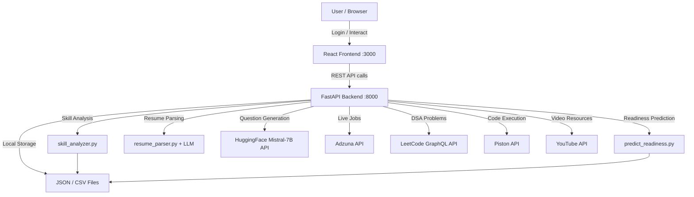
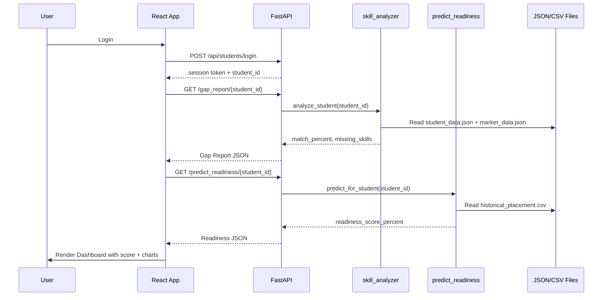
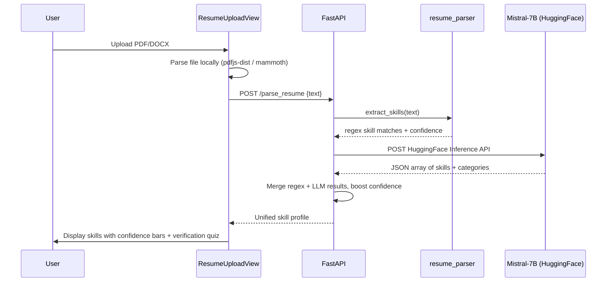
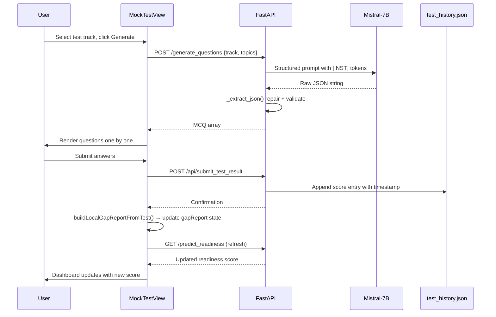
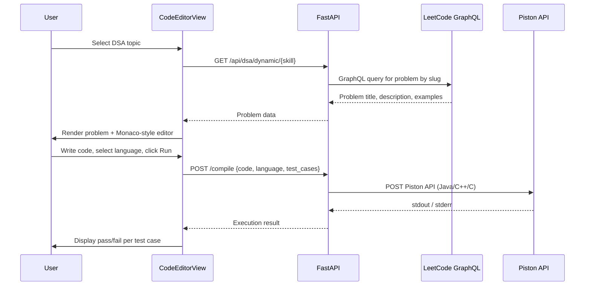

# Placify AI — End-to-End System Architecture

# Placify AI — End-to-End System Architecture

## 1. Project Overview

**Placify AI** is a full-stack, AI-powered placement readiness platform. It bridges the gap between a student's current skill set and real-world job market demands. The system ingests student data (resumes, test scores, profile), processes it through ML models and LLM APIs, and surfaces actionable insights on an interactive React dashboard.

## 2. High-Level Architecture



## 3. Layer-by-Layer Breakdown

### 3.1 Entry Point — Authentication

**File:** file:frontend/src/components/LoginView.js
**Backend:** file:backend/main.py → `/api/login`, `/api/students/login`

| Step | What Happens |
| --- | --- |
| 1 | User opens the app at `localhost:3000` |
| 2 | `LoginView` renders — student or admin can log in |
| 3 | Credentials are SHA-256 hashed and sent to `/api/login` (admin) or `/api/students/login` (student) |
| 4 | Backend returns a session token stored in `localStorage` as `placify_token` |
| 5 | `App.js` sets `isAuthenticated = true` and `userRole` to `'student'` or `'admin'` |
| 6 | The sidebar and main content area render based on role |

### 3.2 Frontend Shell — App.js

**File:** file:frontend/src/App.js

This is the root orchestrator. It owns all global state and routes between views via `activeTab`.

**Global State managed here:**

- `isAuthenticated`, `userRole` — auth state
- `selectedStudent`, `students` — student context
- `gapReport`, `readiness`, `skillGaps`, `atRiskStudents` — backend data
- `history`, `testResult` — test tracking
- `darkMode`, `sidebarOpen` — UI preferences

On authentication, `useEffect` fires four parallel API calls to pre-load all dashboard data.

### 3.3 Frontend Views (Routing via `activeTab`)

| `activeTab` value | Component | Purpose |
| --- | --- | --- |
| `dashboard` | `DashboardView.js` | Readiness score, radar chart, history, benchmarks |
| `tests` | `MockTestView.js` | AI-generated MCQ tests, score submission |
| `gap` | `GapAnalysisView.js` | Skill gap visualizer, missing vs. mastered skills |
| `learning` | `LearningPathView.js` | Milestone path, YouTube resources, certifications |
| `dsa` | `CodeEditorView.js` | LeetCode problems, in-browser code editor & compiler |
| `resume` | `ResumeUploadView.js` | PDF/DOCX upload, skill extraction, verification |
| `profile` | `ProfileView.js` | Student profile, history, readiness summary |
| `admin` | `AdminDashboardView.js` | At-risk students, skill gap heatmap |
| `manage_students` | `ManageStudentsView.js` | Admin CRUD on student records |

### 3.4 Backend API — FastAPI

**File:** file:backend/main.py
**Base URL:** `http://127.0.0.1:8000`

All endpoints are protected by a Bearer token dependency (`get_current_user`). CORS is open to allow the React dev server.

#### API Endpoint Map

| Endpoint | Method | Service Called | Returns |
| --- | --- | --- | --- |
| `/api/login` | POST | In-memory admin store | Session token |
| `/api/students/login` | POST | `student_data.json` | Session token + student ID |
| `/gap_report/{student_id}` | GET | `skill_analyzer` | Missing skills, match %, certifications |
| `/predict_readiness/{student_id}` | GET | `predict_readiness` | Readiness score %, prediction label |
| `/admin/skill_gaps` | GET | `skill_analyzer` | Aggregated missing skill frequencies |
| `/admin/at_risk_students` | GET | `test_history.json` | Students with stagnant/declining scores |
| `/parse_resume` | POST | `resume_parser` + Mistral-7B | Extracted skills with confidence scores |
| `/api/live_jobs/{role}` | GET | `adzuna_client` | Live job listings |
| `/generate_questions` | POST | Mistral-7B (HuggingFace) | MCQ question arrays |
| `/compile` | POST | Piston API / local Python | Code execution result |
| `/api/dsa/dynamic/{skill}` | GET | LeetCode GraphQL API | DSA problems by topic |
| `/api/dsa/recommendation/{student_id}` | GET | `skill_analyzer` | Recommended DSA problems |
| `/api/submit_test_result` | POST | `test_history.json` | Confirmation |
| `/api/youtube/search` | GET | YouTube Data API | Tutorial video results |
| `/skill_quiz/{skill_name}` | GET | JSON question bank | Skill-specific quiz |
| `/validate_skills` | POST | Quiz scoring logic | Verified skill list |

### 3.5 Core Backend Services

#### `skill_analyzer.py`

**File:** file:backend/services/skill_analyzer.py

- Loads `student_data.json` and `market_data.json`
- Computes **Jaccard similarity** between student skills and target role requirements
- Returns `match_percent`, `missing_skills`, `current_skills`, `recommended_certifications`

#### `predict_readiness.py`

**File:** file:backend/services/predict_readiness.py

- Loads `historical_placement.csv` and trains a **RandomForest classifier** on CGPA, project count, and skill match %
- Predicts a `readiness_score_percent` (0–100) and a label (`Ready`, `Needs Work`, etc.)
- Called on every dashboard load and after each test submission

#### `resume_parser.py`

**File:** file:backend/services/resume_parser.py

- Pure regex keyword matching against a curated `SKILL_KEYWORDS` dictionary (18+ skills, 200+ synonyms)
- Confidence scoring formula: `min(95, 20 + match_count × 18)`
- Returns structured skill profile with category, confidence, and matched keywords

#### `llm_resume_analyzer.py`

**File:** file:backend/services/llm_resume_analyzer.py

- Sends resume text to **Mistral-7B** via HuggingFace Inference API
- Uses `[INST]...[/INST]` prompt tokens to force structured JSON output
- Extracts nested/implicit skills that regex misses, suggests job roles, categorizes skills

#### `adzuna_client.py`

**File:** file:backend/services/adzuna_client.py

- Calls `api.adzuna.com/v1/api/jobs` with role + country params
- Returns job title, company, location, salary range, and redirect URL
- Also extracts trending skills from job descriptions for gap calibration

### 3.6 Data Layer

**Directory:** file:backend/data/

| File | Role |
| --- | --- |
| `student_data.json` | Student profiles — skills, CGPA, projects, target role |
| `market_data.json` | Role → required skills mapping (industry standards) |
| `test_history.json` | Per-student test score history with timestamps |
| `historical_placement.csv` | Training data for the RandomForest model |

<user_quoted_section>There is no external database. All persistence is file-based JSON/CSV, acting as a lightweight NoSQL + relational mock system.</user_quoted_section>

### 3.7 External Integrations

| Service | Purpose | Fallback |
| --- | --- | --- |
| **HuggingFace Mistral-7B** | MCQ generation, resume LLM analysis | Regex parser only / static question bank |
| **Adzuna API** | Live job listings, trending skills | Mock job data |
| **LeetCode GraphQL API** | DSA problem fetch by topic slug | Static problem set |
| **Piston API** | Remote code execution (Java, C++, C) | Local Python subprocess sandbox |
| **YouTube Data API** | Tutorial video search for learning path | Curated mock video list |

## 4. End-to-End Data Flow

### Flow A — Dashboard Load (most common path)



### Flow B — Resume Upload & Analysis



### Flow C — Mock Test → Readiness Update



### Flow D — DSA Coding Lab



## 5. Frontend Component Wireframe

```wireframe

<html>
<head>
<style>
  * { box-sizing: border-box; margin: 0; padding: 0; font-family: sans-serif; }
  body { display: flex; height: 100vh; background: #f8f9fc; }
  .sidebar { width: 240px; background: #0f172a; color: white; display: flex; flex-direction: column; padding: 24px 16px; gap: 8px; flex-shrink: 0; }
  .logo { font-size: 18px; font-weight: 900; color: white; margin-bottom: 24px; padding: 8px; }
  .logo span { color: #6366f1; }
  .nav-item { padding: 10px 14px; border-radius: 10px; font-size: 13px; color: #94a3b8; cursor: pointer; display: flex; align-items: center; gap: 10px; }
  .nav-item.active { background: #6366f1; color: white; }
  .nav-item:hover:not(.active) { background: #1e293b; }
  .nav-icon { width: 16px; height: 16px; background: currentColor; border-radius: 3px; opacity: 0.7; flex-shrink: 0; }
  .user-card { margin-top: auto; background: #1e293b; border-radius: 12px; padding: 12px; display: flex; align-items: center; gap: 10px; }
  .avatar { width: 36px; height: 36px; border-radius: 50%; background: #6366f1; display: flex; align-items: center; justify-content: center; font-size: 11px; font-weight: bold; color: white; flex-shrink: 0; }
  .user-info { flex: 1; }
  .user-name { font-size: 12px; font-weight: bold; color: white; }
  .user-role { font-size: 10px; color: #64748b; text-transform: uppercase; }
  .main { flex: 1; padding: 32px; overflow-y: auto; }
  .page-title { font-size: 22px; font-weight: 800; color: #1e293b; margin-bottom: 24px; }
  .cards { display: grid; grid-template-columns: repeat(3, 1fr); gap: 16px; margin-bottom: 24px; }
  .card { background: white; border-radius: 14px; padding: 20px; border: 1px solid #e2e8f0; }
  .card-label { font-size: 11px; color: #94a3b8; text-transform: uppercase; font-weight: 700; margin-bottom: 8px; }
  .card-value { font-size: 28px; font-weight: 900; color: #1e293b; }
  .card-sub { font-size: 11px; color: #64748b; margin-top: 4px; }
  .charts { display: grid; grid-template-columns: 2fr 1fr; gap: 16px; }
  .chart-box { background: white; border-radius: 14px; padding: 20px; border: 1px solid #e2e8f0; }
  .chart-title { font-size: 13px; font-weight: 700; color: #1e293b; margin-bottom: 16px; }
  .chart-placeholder { background: #f1f5f9; border-radius: 8px; height: 140px; display: flex; align-items: center; justify-content: center; color: #94a3b8; font-size: 12px; }
  .skill-list { display: flex; flex-direction: column; gap: 8px; }
  .skill-row { display: flex; align-items: center; gap: 10px; font-size: 12px; }
  .skill-bar-bg { flex: 1; height: 6px; background: #f1f5f9; border-radius: 99px; }
  .skill-bar { height: 6px; border-radius: 99px; background: #6366f1; }
  .skill-pct { font-size: 11px; color: #64748b; width: 32px; text-align: right; }
</style>
</head>
<body>
  <div class="sidebar">
    <div class="logo">Placify <span>AI</span></div>
    <div class="nav-item active"><div class="nav-icon"></div> Dashboard</div>
    <div class="nav-item"><div class="nav-icon"></div> Mock Assessments</div>
    <div class="nav-item"><div class="nav-icon"></div> Gap Visualizer</div>
    <div class="nav-item"><div class="nav-icon"></div> Milestone Path</div>
    <div class="nav-item"><div class="nav-icon"></div> DSA Coding Lab</div>
    <div class="nav-item"><div class="nav-icon"></div> Resume Analyzer</div>
    <div class="nav-item"><div class="nav-icon"></div> Profile Settings</div>
    <div class="user-card">
      <div class="avatar">SJ</div>
      <div class="user-info">
        <div class="user-name">S001</div>
        <div class="user-role">Premium Student</div>
      </div>
    </div>
  </div>
  <div class="main">
    <div class="page-title">Dashboard</div>
    <div class="cards">
      <div class="card">
        <div class="card-label">Readiness Score</div>
        <div class="card-value" style="color:#6366f1">78%</div>
        <div class="card-sub">↑ +5% from last test</div>
      </div>
      <div class="card">
        <div class="card-label">Skill Match</div>
        <div class="card-value">64%</div>
        <div class="card-sub">Target: Software Engineer</div>
      </div>
      <div class="card">
        <div class="card-label">Missing Skills</div>
        <div class="card-value" style="color:#ef4444">4</div>
        <div class="card-sub">Docker, K8s, CI/CD, AWS</div>
      </div>
    </div>
    <div class="charts">
      <div class="chart-box">
        <div class="chart-title">Readiness History</div>
        <div class="chart-placeholder">Line Chart — Score over time</div>
      </div>
      <div class="chart-box">
        <div class="chart-title">Skill Radar</div>
        <div class="skill-list">
          <div class="skill-row">Technical<div class="skill-bar-bg"><div class="skill-bar" style="width:85%"></div></div><div class="skill-pct">85%</div></div>
          <div class="skill-row">Quant<div class="skill-bar-bg"><div class="skill-bar" style="width:70%"></div></div><div class="skill-pct">70%</div></div>
          <div class="skill-row">Logical<div class="skill-bar-bg"><div class="skill-bar" style="width:75%"></div></div><div class="skill-pct">75%</div></div>
          <div class="skill-row">Verbal<div class="skill-bar-bg"><div class="skill-bar" style="width:65%"></div></div><div class="skill-pct">65%</div></div>
          <div class="skill-row">Soft Skills<div class="skill-bar-bg"><div class="skill-bar" style="width:80%"></div></div><div class="skill-pct">80%</div></div>
        </div>
      </div>
    </div>
  </div>
</body>
</html>
```

## 6. File Structure Reference

```
final project/
├── backend/
│   ├── main.py                        ← FastAPI app, all endpoints
│   ├── data/
│   │   ├── student_data.json          ← Student profiles
│   │   ├── market_data.json           ← Role → skill requirements
│   │   ├── test_history.json          ← Test score history
│   │   └── historical_placement.csv  ← ML training data
│   └── services/
│       ├── skill_analyzer.py          ← Jaccard similarity, gap analysis
│       ├── predict_readiness.py       ← RandomForest readiness model
│       ├── resume_parser.py           ← Regex skill extraction
│       ├── llm_resume_analyzer.py     ← Mistral-7B LLM skill extraction
│       └── adzuna_client.py           ← Live job market API client
├── frontend/
│   ├── src/
│   │   ├── App.js                     ← Root shell, global state, routing
│   │   ├── components/
│   │   │   ├── LoginView.js           ← Auth screen
│   │   │   ├── DashboardView.js       ← Main student dashboard
│   │   │   ├── MockTestView.js        ← AI-generated MCQ tests
│   │   │   ├── GapAnalysisView.js     ← Skill gap visualizer
│   │   │   ├── LearningPathView.js    ← Milestone & resource path
│   │   │   ├── CodeEditorView.js      ← DSA coding lab
│   │   │   ├── ResumeUploadView.js    ← Resume parser UI
│   │   │   ├── ProfileView.js         ← Student profile
│   │   │   ├── AdminDashboardView.js  ← Admin analytics
│   │   │   └── ManageStudentsView.js  ← Admin student management
│   │   ├── data/
│   │   │   ├── questions.js           ← Static MCQ fallback bank
│   │   │   ├── skillData.js           ← Skill metadata
│   │   │   └── mockTestQuestionBank.js← Extended question bank
│   │   └── utils/
│   │       ├── resumeTestGenerator.js ← Resume-based quiz generator
│   │       └── questionTemplates.js   ← MCQ template helpers
│   └── package.json
├── requirements.txt                   ← Python dependencies
└── Project_Documentation.md          ← Full project documentation
```

## 7. Key Design Decisions

| Decision | Rationale |
| --- | --- |
| File-based storage (JSON/CSV) | No database setup required; portable for academic/demo context |
| RandomForest trained on every request | Simplicity over performance; acceptable for small datasets |
| Regex + LLM hybrid resume parsing | Regex is fast and deterministic; LLM catches implicit/nested skills |
| Piston API for code execution | Avoids running untrusted code locally; supports multiple languages |
| HuggingFace free inference tier | Zero cost for Mistral-7B; rate-limited but sufficient for demo |
| Single-page app with `activeTab` routing | No React Router needed; simpler state management for a focused tool |